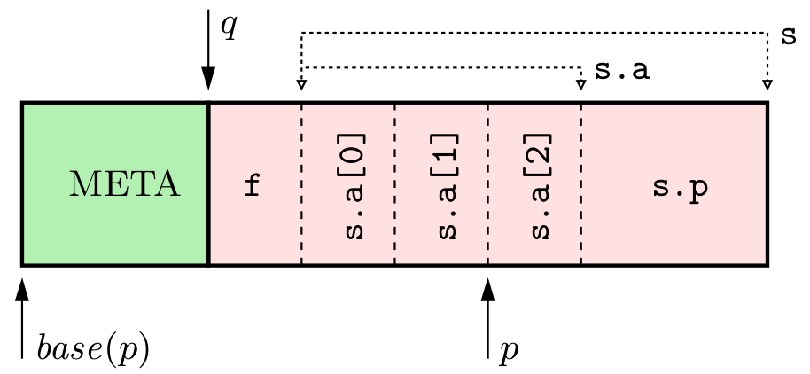
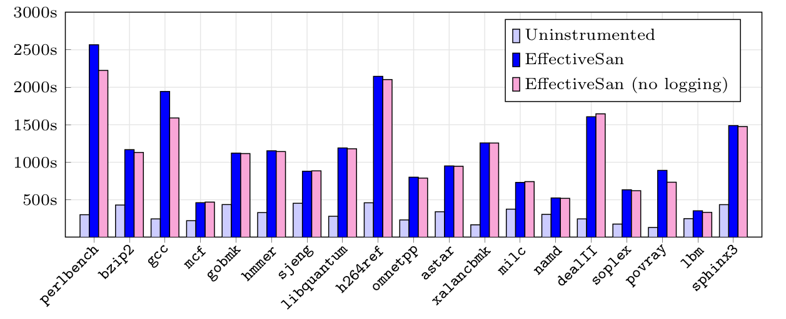

The Effective Type Sanitizer --- Dynamically Typed C/C++
========================================================

EffectiveSan is a compiler tool that automatically inserts dynamic 
(i.e., runtime) type and bounds checking into C/C++ programs.  The aim of
EffectiveSan is to detect memory errors and type bugs in arbitrary C/C++ code.

Background
----------

C and C++ are examples of *statically typed* programming languages, meaning
that types are checked at compile time and not at runtime.  Furthermore, C
and C++ are *weakly typed* programming languages that allow the type system
to be bypassed, including:

* **Arbitrary Casts**, e.g., casting from a (`T *`) to an (`S *`) is
  possible (both explicitly and implicitly via operations like `memcpy`); and
* **No Bounds Checking**, e.g., if reading the `i`th element
  of a (`int[50]`) array object, then it is never checked
  (statically or dynamically) that (`i < 50`); and
* **Use-after-free** (allowing possible type mutation) is also possible.

Weak static typing is primarily motivated by flexibility and efficiency
(dynamic type and bounds checking is expensive).  However, this also means
that the programmer is responsible for ensuring that types are not violated at
runtime.  In practice, the programmer does not always get it right, and bugs
relating to type violations are common and potentially serious.  For example,
consider the following "benign" code snippet:

        struct S {int a[3]; char *p;};
        struct T {float f; struct S s;};

        int get(struct T *t, int idx)
        {
            return t->s.a[idx];
        }

This snippet is well-typed according to standard C/C++ static type checking.
However, at runtime, a lot can go wrong:

* **Type Confusion Errors**: Pointer `t` may be of the wrong type:

        S *s = (S *)malloc(sizeof(struct S));
        get((T *)s, 2);

* **Use-after-free Errors**: Pointer `t` may have been `free`'ed:

        free(t);
        get(t, 2);

* **(Sub-)Object Bounds Errors**: Index `idx` may be outside the bounds of
  the (sub-)object (`a`):

        get(t, 3);

In practice, type and memory errors can be a lot more subtle, and are a common
source of security vulnerabilities, program bugs, and other undefined
behavior.  For example, such errors are commonly exploited for *control flow
hijacking* attacks, e.g., by overwriting the *virtual function table pointer*
(`vptr`) of C++ objects.  This can be achieved in several ways using the
runtime errors described above, including:

* Using a *object bounds overflow* from object `A` to `B` to
  directly overwrite `B.vptr`;
* Using a *sub-object bounds overflow* within the same object `B` to
  directly overwrite `B.vptr`;
* Using *type confusion* to cast a pointer `p` to `B` to a different type,
  then overwrite `B.vptr` indirectly using a "valid" operation on `p`; and
* Using a *Use-after-free* similar to type confusion, where previously
 `free`'ed pointer `p` points to a different type.

Assuming an attacker can overwrite the `vptr` with a suitable value, control
flow can then be hijacked using a call to a virtual function.

Beyond security, it is often useful to detect and eliminate deliberate
type-based undefined behavior---so-called *type abuse*---since it can harm
code quality/portability.  For example, one idiom we have observed in the wild
is to implement C++-style inheritance using structures with overlapping
members, e.g.:

        struct Base { int x; float y; };
        struct Derived { int x; float y; char z; };

We have observed such idioms in SPEC2006's `perlbench` and `povray` benchmarks
(despite `povray` being a C++ program).
Such idioms may violate the compiler's *Type Base Aliasing Analysis* (TBAA)
assumptions, causing code to be miscompiled, else requiring special compiler
options such as `-fno-strict-aliasing`.  Type abuse may also mask dangerous
(security critical) type errors as well.

Dynamic Typing for C and C++
----------------------------

The *Effective Type Sanitizer* (EffectiveSan) is a tool for instrumenting
C/C++ programs with *dynamic type checks*---effectively transforming C/C++
into a *dynamically typed* programming languages.  The instrumented dynamic
type check compares the runtime type of an object (a.k.a. the *effective
type* using C standard terminology) against the static type declared in the
code.  An *error* will be logged if there is a mismatch.

For example, EffectiveSan will *instrument* the `get()` function by adding
type and bounds checks:

        int get(struct T *t, int idx)
        {
            BOUNDS b = type_check(t, struct T);     // Inserted type check
            b = bounds_narrow(b, t->s.a);           // Inserted bounds narrow
            int *tmp = &t->s.a;
            bounds_check(tmp, b);                   // Inserted bounds check
            return tmp[idx];
        }

Here, three additional operations are inserted:

* `type_check` checks that the dynamic type of pointer `t` matches the
  static type (`struct T`).  This means that `t` must point to either an
  object of type `struct T`, a *sub-object* of type `struct T` of some
  larger object, or a (sub-)object of some other type coercible to type
  `struct T` (e.g., a character array `char[]`).  If the type is compatible,
  the dynamic (sub-)object bounds is returned.
* `bounds_narrow` narrows the bounds `b` to the sub-object of interest.
  In this case, the sub-object is `s.a`.
* `bounds_check` verifies that the memory access is within the narrowed
  bounds.

If either `type_check` or `bounds_check` fails then an error will be logged.
By default, all logged errors are printed to `stderr` when the program exits
(EffectiveSan does not stop execution, although this is configurable).

The inserted instrumentation can detect type and memory errors described
above.  For example, consider the *type error*:

        S *s = (S *)malloc(sizeof(struct S));
        get((T *)s, 2);

Then running this program results in a *type error*:

        TYPE ERROR:
                pointer  = 0x30a12d3740 (heap)
                expected = struct T
                actual   = struct S { int32_t[3]; /*0..12*/ int8_t *; /*16..24*/ } [+0]
                           >int32_t [+0]

Here:

* `pointer` is the pointer value, which happens to be allocated from the heap;
* `expected` is the expected type, which in this case is (`struct T`); and
* `actual` is the actual dynamic type of the pointer.  The "actual" type
  is represented as a set of (`type [+offset]`) pairs, starting from the
  allocation type of the object (`struct S`), all the way to the type of
  the inner-most sub-object at the same offset (`int32_t`, a.k.a. `int`).
  Offset values are in bytes.  Any pair with zero offset (i.e., `[+0]`)
  represents a valid type for the pointer.  In other words, this is a type
  error because there is no "actual" type pair corresponding to
  (`struct T [+0]`).

Next, consider the *use-after-free error*:

        free(t);
        get(t, 2);

EffectiveSan considers "free" objects to have a special "`<free memory>`"
type.  This allows use-after-free errors to be detected as a special kind
of type error:

        USE-AFTER-FREE ERROR:
                pointer  = 0x4034b5bfd0 (heap)
                expected = struct T
                actual   = <free memory> [+0]

Finally, consider the *(sub-)object bounds error*:

        get(t, 4)

EffectiveSan uses dynamic typing and bounds narrowing to detect sub-object
bounds errors:

        SUBOBJECT BOUNDS ERROR:
                pointer  = 0x405efddc68 (heap)
                type     = struct T { float32_t; /*0..4*/ struct S; /*8..32*/ } [+8..+20]
                           >struct S { int32_t[3]; /*0..12*/ int8_t *; /*16..24*/ } [+0..+12]
                           >>int32_t [+0..+12]
                bounds   = 0..12 (8..20)
                access   = 16..20 (24..28)

Here:

* `pointer` is the pointer value, similar to before;
* `type` is a set of (`type [+lb..+ub]`) triples representing the dynamic type
  of the accessed (sub-)object, and the accessed sub-object's bounds.  Bounds
  are pairs of byte offsets;
* `bounds` is the bounds of the accessed sub-object in (1) bounds relative
  to the start of the sub-object, and (2) bounds relative to the start of
  the allocation; and
* `access` is the bounds of the memory access, relative to (1) and (2)
  explained above.

Using the above instrumentation, EffectiveSan can detect multiple classes of
errors, including type confusion, object bounds errors, sub-object bounds
errors, and use-after-free errors---all using the same underlying methodology.

How EffectiveSan Works
----------------------

We give a very brief overview on how some of the internals of EffectiveSan
work.  For more detailed information, please see our paper (see *further
reading* below) or study the source code.

EffectiveSan consists of three main components:

1. A "modified" `clang` front-end that preserves high-level
   C/C++ type information as LLVM IR meta-data.
1. A LLVM-instrumentation pass that inserts type/bounds checks, as well as
   replaces memory allocation with the "typed" version.
1. A run-time support library that implements the meta data tracking scheme.

The runtime system for tracking dynamic types is the main innovation.  The
basic idea is to build on top of *low fat pointers* which are a system for
tracking the *bounds* (size and base) of allocated objects, which was
originally developed for bounds checking.  Instead, EffectiveSan uses low fat
pointers to store *type meta data at the base of allocated objects*.  For
example, consider the memory allocation:

        q = (struct T *)malloc(sizeof(struct T));

Then, under EffectiveSan, the memory layout will be as follows:

Here (`META`) is the EffectiveSan object meta data comprising (1)
a reference to the *type meta data* for (`struct T`), and (2) the
size (array length) of the allocation.  Note that `META` is stored in the
memory immediately before the allocated object.  The memory layout of
the object itself is unchanged, which is critical for compatibility.
EffectiveSan similarly transforms stack and global objects.

The combined `META` and object are allocated using the low-fat pointer
allocator.  This means that any interior pointer, e.g., (`p`) can be
efficiently mapped to the base address (`base(p)`) which contains `META`.  The
EffectiveSan runtime therefore has access to the following information:

1. The *dynamic type* of (`q`) (from `META`);
1. The *static type* of (`p`) (from the source code); and
1. The *offset* between (`p`) and (`q`) (calculated).

The EffectiveSan runtime maps the (*dynamic-type*, *static-type*, *offset*)
triple to (sub-)object bounds (relative to `p`) using a *layout hash table*
stored in the type meta data.  For example, the layout hash table for (`struct
T`) is as follows:

        (T, T, 0) ---> -oo..oo     (T, float, 0) ---> 0..4     (T, S, 4) ---> 0..20
        (T, int, 4) ---> 0..12     (T, int, 8) ---> -4..8      (T, int, 12) ---> −8..4
        (T, char *, 16) ---> 0..8

Each entry represents a (sub-)object for type (`struct T`).

For example, if `p` has the static type (`int *`), the corresponding
triple will be `(T, int, 12)`.  This triple corresponds to the sub-object
(`T.s.a`), and the sub-object bounds (in bytes) is therefore `p-8..p+4`.

In contrast, if `p` has the static type (`float *`), the corresponding
triple will be `(T, float, 12)`.  This triple has no entry (i.e., a hash table
miss), meaning that a type error is detected.

Benchmarks
----------

We compare EffectiveSan against an uninstrumented baseline.  For these tests,
we use the standard SPEC2006 benchmark suite:

We also compare two different versions of EffectiveSan:

* EffectiveSan; and
* EffectiveSan (no logging).

Both versions use the `EFFECTIVE_SINGLETHREADED` runtime option (SPEC2006 is
single-threaded), and the "no logging" version uses the additional
`EFFECTIVE_NOLOG` runtime option.  The former represents "normal" use, which
includes both instrumentation and logging overheads, while the latter is a
better estimate of the instrumentation overhead only.  Some benchmarks,
notably `perlbench` and `gcc`, generate many errors meaning the logging
overhead is more significant.

Overall we see that EffectiveSan (logging) is 3.53x the uninstrumented
baseline, and EffectiveSan (no logging) is slightly faster at 3.41x the
baseline.  For reference, a typical bounds checking sanitizer (e.g.,
AddressSanitizer), that does no type nor sub-object bounds checking, has a
typical overhead of 1.5-2.0x.  EffectiveSan is intended to be a trade-off:
although it is generally more expensive it is also more comprehensive in
the class and number of errors detected.

EffectiveSan exhibits a low memory overhead of 1.12x for SPEC2006.

EffectiveSan detects may type, (sub-)object bounds, and use-after-free errors
in the SPEC2006 benchmarks, some known and some new.  These include:

* A use-after-free bug in `perlbench` (`test` benchmark only,
  previously found by ASAN).
* A bounds overflow error in `h264ref` (previously found by ASAN).
* Sub-object bounds overflow errors in `gcc`, `h264ref` and `soplex`.
* Multiple type errors.

The type errors are summarized in the paper (see *further reading* below).
Most type errors appear to be related to *type abuse*, i.e., deliberate type
errors introduced by the programmer.  Although sometimes it is hard to be sure
without knowing the programmer's intent.  Some examples of type errors
include:

* `xalancbmk` uses bad C++ downcasts, e.g. casting a `DTDGrammar` to a 
  `SchemaGrammar`;
* `gcc`/`sphinx3` casting objects to (`int[]`) to calculate hash values or
   checksums;
* `gcc` using incompatible definitions (over different modules) for the "same"
  type;
* `bzip2`/`lbm` confusing fundamental types (e.g., `int` vs `float`, etc.);
* `perlbench`/`povray`'s ad hoc implementation of C++-style
   inheritance by defining structures with a common shared
   prefix.

Further Reading
---------------

For more detailed information EffectiveSan, please see our PLDI'2018 paper:

* Gregory J. Duck and Roland H. C. Yap, [*EffectiveSan: Type and
  Memory Error Detection using Dynamically Typed
  C/C++*](https://www.comp.nus.edu.sg/~gregory/papers/pldi18types.pdf),
  Programming Language Design and Implementation (PLDI'18), 2018

EffectiveSan is built on top of our earlier work on *low fat pointers*.  More
information can be found here:

* Gregory J. Duck, Roland H. C. Yap, [*Heap Bounds Protection with Low Fat
  Pointers*](https://www.comp.nus.edu.sg/~gregory/papers/cc16lowfatptrs.pdf),
  Compiler Construction (CC'16), 2016
* Gregory J. Duck, Roland H. C. Yap, Lorenzo Cavallaro, [*Stack Bounds
  Protection with Low Fat
  Pointers*](https://www.comp.nus.edu.sg/~gregory/papers/ndss17stack.pdf),
  Network and Distributed System Security Symposium (NDSS'17), 2017
* Implementation:
  [https://github.com/GJDuck/LowFat](https://github.com/GJDuck/LowFat)

Usage
=====

Installing
----------

EffectiveSan releases can be downloaded from here:
[https://github.com/GJDuck/EffectiveSan/releases](https://github.com/GJDuck/EffectiveSan/releases)

EffectiveSan is implemented as a modified version of `clang`/LLVM for the
`x86_64`/Linux architecture.  To use, simply extract the distribution into
your desired location, e.g.:

        $ tar xvfJ effectivesan-VERSION.tar.xz

No other special installation steps are required.

Running
-------

To instrument a program using EffectiveSan, simply compile using the
special modified `clang`/`clang++` and the `-fsanitize=effective -O2` options:

        $ effectivesan-VERSION/bin/clang -fsanitize=effective -O2 program.c
        $ effectivesan-VERSION/bin/clang++ -fsanitize=effective -O2 program.cpp

Note that EffectiveSan *assumes `-O2` optimization level* in order to work
correctly.  Next, the resulting executable can be run as normal:

        $ ./a.out

A logged error messages should be printed to `stderr` when the program exits.

Note that it is common for the same type or bounds error to occur multiple
times during program execution.  By default, EffectiveSan will "group"
similar errors, so as not to make the error log too long.  Grouping behavior
can be changed or disabled using the `EFFECTIVE_VERBOSITY` runtime option
(see *options* below).

Options
-------

EffectiveSan supports several compiler options listed below.  To pass options
to EffectiveSan, use the `-mllvm` `clang` option, e.g.,
`-mllvm -effective-no-globals`:

* `-effective-no-escapes`: Do not instrument pointer escapes.
* `-effective-no-globals`: Do not replace global variables.
* `-effective-no-stack`: Do not replace stack allocations.
* `-effective-blacklist blacklist.txt`: Do not instrument entries from
  the `blacklist.txt` file (in *special case list* format).
* `-effective-warnings`: Enable instrumentation warning messages.
* `-effective-max-sub-objs max`: Set `max` to be the maximum number of
    sub-objects per type meta data.

In addition to the compiler time options, EffectiveSan also supports
several runtime options that can be set via environment variables:

* `EFFECTIVE_NOTRACE=1`: Do not print error stack traces (default off).
* `EFFECTIVE_NOLOG=1`: Do not print the log altogether (default off).
* `EFFECTIVE_SINGLETHREADED=1`: Assume the program is single-threaded
   (default off).
* `EFFECTIVE_MAXERRS=N`: Abort the program after `N` errors
   (default `SIZE_MAX`).
* `EFFECTIVE_VERBOSITY=(0|1|2|9)`: Set error verbosity level, where higher
  means less error grouping, and `9` means no grouping (default `0`).
* `EFFECTIVE_LOGFILE=filename.txt`: Dump the log to `filename.txt` rather
  than `stderr`.

Building
--------

It is also possible to build EffectiveSan from source.  To do so, simply
extract the source distribution and run the `build.sh` script:

        $ ./build.sh

The entire build process should be automatic.

To also build the binary distribution, use the following command instead:

        $ ./build.sh release

FireFox
-------

It is possible to build a version of the FireFox web browser using
EffectiveSan.  For this, run the following commands:

        $ cd firefox
        $ ./setup-firefox-build.sh

If this succeeds, then:

        $ cd firefox-52.2.1esr
        $ ./mach build
        $ ./mach run

Notes:

* Building has only been tested on our own machine:
  "`Linux box 4.13.0-45-generic #50~16.04.1-Ubuntu SMP Wed May 30 11:18:27 UTC 2018 x86_64 x86_64 x86_64 GNU/Linux`"
  using a `Xeon E5-2630 v4` CPU with 32Gb of RAM.
  The build may not work on a different machine.
* The build process will generate some `TEST-UNEXPECTED-FAIL` warnings about
  text relocations.  These should not stop the build from running.
* The resulting FireFox is noticeably slower.  This is to be expected.
* The resulting build has not been extensively tested and should be considered
  **unstable**.  Some websites like `youtube` do not work, but most others
  appear OK under our tests.  Building a stable version of FireFox, including
  removing errors caused by custom memory allocators (CMAs), would require
  considerable effort.  We do not intend to maintain a stable build at this
  time.

Features
========

In addition to the core features (type/bounds/UAF-checking) highlighted
above, EffectiveSan also supports the following:

* **Unions**: `union`s are supported by EffectiveSan the same way
  `struct`s are.  The only difference between a `union` and a `struct`
  is that the offset of each member is always zero.  Otherwise, the
  internal representation and handling is the same.
* **Flexible array members**: These are `struct`s where the last member
  has a flexible size.  For example, with
  (`struct vector {int len; int data[];}`), then `data` is a
  *flexible array member* indicated by an unspecified array size.
  EffectiveSan supports types with flexible array members.
* **C++ inheritance**: Base classes are treated as a special kind of
  sub-object.  Virtual inheritance is also supported.
* **Automatic coercions**: EffectiveSan can automatically coerce memory
  of type (`char[]`) to any type, and vice versa.  Similarly, EffectiveSan
  will automatically coerce (`void *`) and (`T *`), and vice versa.
  Coercions usually incur extra overhead (more hash table lookups).
* **Good compatibility**: EffectiveSan has been designed to (1) **not**
  change the layout of objects in memory, and (2) **not** change the
  *Application Binary Interface* (ABI).  For these reasons, EffectiveSan
  should achieve good compatibility with most existing software.
* **Fast (for what it is)**: Some effort has been invested into optimizing
  EffectiveSan's instrumentation and runtime system.  That said, there is
  probably more room for improvement.

Limitations
===========

EffectiveSan is a complex sanitizer and therefore has some limitations:

* **LowFat limitations**:
  EffectiveSan is built on top of *low fat pointers*
  [LowFat](https://github.com/GJDuck/LowFat) and inherits many of 
  LowFat's underlying limitations.  The main inherited limitations are:
  - Escaping Pointers
  - Global Variables
  - Operating System
  - Modern 64bit CPUs
  - Stack Object Ordering
  - Custom Stacks
  - Runtime Hardening
  - Spectre
  - Low Level Hacks
* **Compilation crashes with a fatal error**:
  For example, with "`fatal error: error in backend: Cannot select: ...`".
  This appears to be a bug in clang itself (and has already been reported).
  More information can be found here:
  [https://github.com/GJDuck/LowFat/issues/12](https://github.com/GJDuck/LowFat/issues/12).
  A work-around is to disable instrumentation for global variables:
  `-mllvm -effective-no-globals -mcmodel=small`.
* **Assembly**: In order to support global variables, LowFat and EffectiveSan
  use the *large* code model.  This also means that any inline or mixed
  assembly must also respect the large code model, else linker errors
  (`relocation truncated to fit`) will occur.  A work-around is to disable
  instrumentation for global variables:
  `-mllvm -effective-no-globals -mcmodel=small`.
* **Malloc type**:
  EffectiveSan assumes that the first cast determines the allocation type for
  pointers returned by `malloc` (and family).  Otherwise, if there is no
  cast, the type will be left as (`char[]`).  Globals, stack allocations,
  and C++ `new` have explicitly declared types so no guessing is required.
* **Simple errors may be missed**:
  EffectiveSan may fail to detect "simple" errors that are statically visible,
  e.g., `int x[100]; x[101] = 3;`.
  This is mainly because `clang`/`LLVM` will "optimize" away such errors
  before the EffectiveSan instrumentation pass.
  EffectiveSan aims to detect "dynamic" errors only.
* **Use-after-free (UAF) error detection is incomplete**:
  EffectiveSan does not detect use-after-free errors that occur *after* a type
  check.  Furthermore, EffectiveSan does not detect use-after-free errors where
  the free'ed object is reallocated to an object of the same type.  Complete
  use-after-free detection in multi-threaded environments is difficult because
  of the race between the pointer dereference, deallocation, and the
  UAF-check.
* **C/C++ undefined behavior**:
  EffectiveSan does not aim to implement a strict interpretation of type-based
  undefined behavior under the C/C++ standards.  To do so would require
  tracking properties such as *pointer provenance*.  Nevertheless,
  EffectiveSan is a reasonable first approximation.
* **Custom Memory Allocators (CMAs)**:
  EffectiveSan assumes that the program uses standard memory allocators,
  such as `malloc` for C and `new` for C++.  If the program uses *Custom
  Memory Allocators* (CMAs) then EffectiveSan may fail to correctly type
  objects, leading to missed errors or false positives.  CMAs are a problem
  for many dynamic analysis tools not just EffectiveSan.
* **Limited multi-dimensional array support**:
  EffectiveSan will flatten top-level multi-dimensional array objects, e.g.
  `int *x = new int[3][4]` will be treated the same as
  `int *x = new int[12]`.  This is because the current implementation of
  the object meta data (`META`) can only encode one array length.
  Multi-dimensional array sub-objects (e.g. a struct member) are handled better.
* **Some types are treated as equivalent**:
  Due to the limitations of the `clang` frontend, some types are treated
  as equivalent.  For example, `int` and `enum`s, `void *` and vptrs,
  pointers and references, etc.
* **Type errors on never-executed paths**:
  EffectiveSan typically inserts the type check near the location where
  a pointer is "created", e.g., the start of a function for a pointer
  argument.  This means it is possible that a type error will be reported
  even if the dereference is never reached.  Early type checks are generally
  faster, e.g., once outside a loop versus every loop iteration.
* **Sub-object merging**:
  EffectiveSan will "merge" overlapping sub-objects with the same type but
  different bounds.  For example, given
  (`union U { struct { int pad; float x[2]; } s; float y[2]; }`),
  then overlapping sub-objects `x` and `y` will be "merged" into a single
  sub-object of type (`float[3]`).  This can only occur for unions.
* **Incomplete type annotations**:
  EffectiveSan relies on a "modified" `clang` front-end to pass C/C++ type
  information down to the LLVM IR level.  However, `clang` was never designed
  to do this, and we are not expert `clang` hackers, so some type information
  is likely to be incomplete.  Our main focus was on ensuring that the SPEC2006
  benchmarks were reasonably covered.
* **Meta data size limits**:
  If a type has too many sub-object (see `-effective-max-sub-objs` limit,
  default `10000`), the generated meta data may be incomplete, resulting in
  missed or spurious errors.
* **Invalid type meta data error**:
  This error may occur if the runtime meta data gets overwritten or unloaded
  somehow (e.g., by uninstrumented code).
* **Error classification**:
  EffectiveSan attempts to classify errors as `TYPE`, `BOUNDS`,
  `SUB-OBJECT-BOUNDS` and `USE-AFTER-FREE`.  However, these are "best guesses"
  and sometimes EffectiveSan may mis-classify errors.  For example:
  - Type confusion may manifest as a sub-object bounds error;
  - Bounds errors (for escaping pointers) may manifest as use-after-free
    errors or type errors.

The EffectiveSan option `-effective-warnings` will enable warnings about
meta data limitations, if any.  The following explains the meaning of
each possible warning message:

* `missing type meta data for value...`: The modified clang frontend failed
  to annotate a value.  This usually indicates there is a missing case
  somewhere in the frontend.
* `type (T) is a forward declaration...`: A type annotation exists but it
  is a forward declaration (empty definition).  The frontend has been modified
  to avoid emitting forward declarations, however, the modifications are not
  perfect.  This may result in type errors that are false positives.
* `type (T) has too many sub-objects...`: The `-effective-max-sub-objs`
  limit was reached, so EffectiveSan attempts to delete some (probably unused)
  sub-objects.  However, this may result in type errors that are
  false positives.
* `unable to instrument constant pointer cast...`: There appears to be
  no way to annotate constant expressions (as far as we know),
  so EffectiveSan cannot yet instrument such casts.

We have mainly focused on minimizing such warnings for the SPEC2006
benchmarks.  Other software may yield different results.

FAQ
===

**Q: Why do we need EffectiveSan when we already have AddressSanitizer?**

AddressSanitizer is a popular tool for detecting memory errors
such as bounds overflows and use-after-free errors.  EffectiveSan can also
detect these kinds of errors, as well as other classes of error that
AddressSanitizer cannot detect, such as:

* **Sub-object overflows**: Bounds errors within the same object.
  AddressSanitizer can only detect overflows that escape the bounds of
  the allocation; and
* **Type errors**: Accessing memory using the wrong type.

In addition to AddressSanitizer, there are a whole bunch of dynamic
memory and type error detection tools.
The main difference is that EffectiveSan attempts to be as comprehensive
as possible, i.e., detecting all type/memory errors using a single
underlying methodology.

**Q: Why does EffectiveSan report so many type errors?  Most type errors are
  harmless.**

EffectiveSan reports *anything* deemed to be a type violation.  Programmers
sometimes introduce "deliberate" type errors for various reasons, such as
convenience, efficiency, "cool hacks", etc.  This is so-called "*type abuse*".
EffectiveSan does not (and cannot) distinguish between accidental and
deliberate type errors.

Although type abuse may seem harmless, it is nevertheless undefined behavior
under the C/C++ standards.  One common problem is the interaction of *type
abuse* and *Type Based Alias Analysis* (TBAA), which can result in the program
being "mis-compiled".

**Q: Why does EffectiveSan report type errors for `std::map` and `std::set`?**

For example, one typical type error is something like the following:

        TYPE ERROR:
                pointer  = 0x1a00d02adb0 (heap)
                expected = struct std::_Rb_tree_node<std::pair<xalanc_1_8::XalanQNameByReference const, xalanc_1_8::ElemTemplate const*> >
                actual   = ...
                           ...
                           >>>>>struct std::_Rb_tree_node_base { int32_t; /*0..4*/ struct std::_Rb_tree_node_base *; /*8..16*/ struct std::_Rb_tree_node_base *; /*16..24*/ struct std::_Rb_tree_node_base *; /*24..32*/ } [+0]

These errors are caused by a combination of (1) bad casts in C++ standard
library header files, and (2) EffectiveSan may report type errors on
never-executed paths.  For example, the `end()` method contains a bad cast
from a `_Rb_tree_node_base` to a `_Rb_tree_node` (a.k.a. `_Link_type`):

        _Link_type
        _M_end() _GLIBCXX_NOEXCEPT
        { return reinterpret_cast<_Link_type>(&this->_M_impl._M_header); }

This appears to be "type abuse" rather than an actual bug.  These bad casts are
also detected by other dynamic type checking tools such as CaVer.

Versions
========

EffectiveSan should be considered alpha quality software.  Since EffectiveSan
is relatively complex, there are probably a lot of bugs.  Please report issues
here: [https://github.com/GJDuck/EffectiveSan/issues](https://github.com/GJDuck/EffectiveSan/issues)

The released version of EffectiveSan has been improved since the prototype
evaluated in the paper.  Generally, the released version is faster (3.41x
alpha overhead versus 3.88x for the prototype), contains fewer bugs, and
offers more comprehensive error detection.  The featured SPEC2006 issues
reported in the paper text should be reproducible using the released alpha
version.  The issue count (Figure 7) should be generally consistent with the
released alpha version, although the exact counts have changed due to bug
fixes and different C++ standard library versions.

Thanks
======

This research was partially supported by a grant from
the National Research Foundation, Prime Minister's Office,
Singapore under its National Cybersecurity R&D Program
(TSUNAMi project, No. NRF2014NCR-NCR001-21) and administered
by the National Cybersecurity R&D Directorate.

